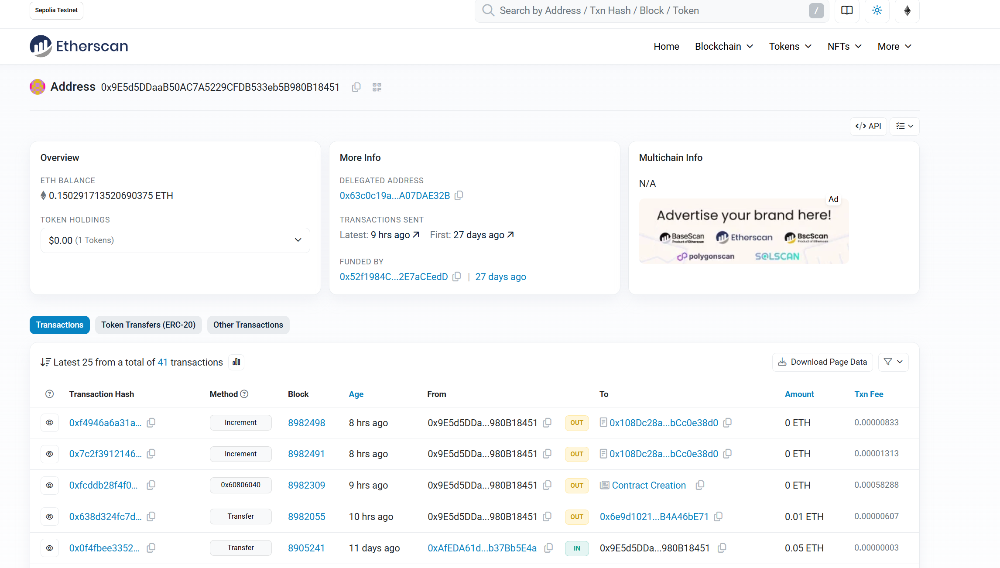

# 一.阐述Geth在以太坊生态中的定位

在以太坊生态中，**Geth（Go-Ethereum）**的定位可以概括为：

------

## 1. **核心客户端（Ethereum Node Client）**

- Geth 是 **以太坊官方发布的三大主流客户端之一**（另两个是 Nethermind 和 Besu）。

- 它用 Go 语言实现，目标是成为一个**全节点（Full Node）软件**，直接运行在以太坊网络上。

  ```go
  [ Consensus Layer ]  ← 验证者、区块提议/投票
  [ Execution Layer ]  ← EVM执行交易、维护状态、交易池
  [ Networking Layer ] ← 节点通信、交易/区块传播
  ```

- 运行 Geth 就是在本地运行一个 **以太坊协议的实现**，能够参与区块验证、交易广播、链状态同步等核心工作。

------

## 2. **区块链网络入口**

在以太坊网络中，客户端（比如 Geth）是应用和区块链的**桥梁**：

- 作为**网络节点**，Geth 与其他节点通过 **P2P 协议（devp2p）**同步区块、交易、状态。
- 提供 **JSON-RPC / WebSocket / IPC API**，让 DApp、钱包、脚本等外部程序访问链上数据、发送交易、调用智能合约。
- 无论你是开发者（部署合约）还是矿工（验证区块），都可以通过 Geth 接入以太坊网络。

------

## 3. **多角色运行**

Geth 可以在不同模式下运行：

- **全节点（Full Node）**
   保存区块链完整数据，从创世区块开始验证所有交易和区块。
- **轻节点（Light Node）**
   只存储区块头，按需向全节点请求数据。
- **归档节点（Archive Node）**
   保存以太坊历史上每个区块的完整状态（适合数据分析、区块链浏览器）。

------

## 4. **执行层（Execution Layer）实现**

- 自从以太坊合并（The Merge）之后，Geth 专注于**执行层（EVM + 状态）**的实现，负责：
  - 解析并执行交易（调用 EVM 解释器）
  - 维护链的状态数据库（账户余额、合约存储）
  - 验证交易的合法性
- 共识层（比如 Lighthouse、Prysm）与 Geth 协同工作，Geth 不再自己负责 PoW/PoS 共识，但依然是执行层的主力实现。

------

## 5. **生态中的地位**

- **开发者常用工具链核心**
   许多开发框架（Hardhat、Foundry、Truffle）在本地测试或连接测试网时，都支持/默认用 Geth 节点。
- **研究和实验的基础设施**
   搭建私链、本地测试链、开发分叉网络时，Geth 常是第一选择。
- **生产环境支柱**
   很多交易所、钱包、DeFi 协议的后台，都直接运行 Geth 节点作为链数据源。

------

📌 **一句话总结**

> Geth 是以太坊的“发动机”，它不是浏览器、不是钱包，而是驱动整个链正常运行的底层客户端，既能作为你访问区块链的 API 入口，也能作为网络的核心节点参与共识与执行。

------

## 6.PoS时代的定位

在 **PoS 时代（The Merge 之后）**：

- **Geth** 已经**不再负责共识**，它专注于 **执行层（Execution Layer）** 的角色。
- 共识层（Consensus Layer）由 **Prysm、Lighthouse、Teku、Nimbus** 等客户端负责。

------

### 对比合并前后的角色

#### **合并前（PoW 时代）**

- Geth 既负责**执行交易**，也负责**PoW 挖矿共识**。
- 你只运行一个 Geth，就能同步、验证、生产区块。

#### **合并后（PoS 时代）**

- **执行层（Execution Layer）**：Geth 运行 EVM，处理交易，维护状态，提供 RPC API。
- **共识层（Consensus Layer）**：验证者投票、提议区块、达成链的最终性。
- 两层之间通过 **Engine API** 协作。
- 如果你只运行 Geth，它会卡住，因为它需要共识层提供区块头与顺序。

------

📌 **一句话总结**

> PoS 时代，Geth 是以太坊的“交易和状态引擎”，但**不负责决定哪个区块被选中**——这个工作交给了共识层客户端。


# 二.解释核心模块交互关系

## 区块链同步协议（eth/62,eth/63）

Ethereum 节点主要分为：

- **全节点（Full Node）**：存储完整区块链和状态数据，可以独立验证交易和区块。
- **轻节点（Light Node）**：只存区块头和最必要的信息，需要向全节点请求状态数据。
- **归档节点（Archive Node）**：存储历史所有状态，几乎不用于普通同步。

Ethereum 的节点启动时必须同步数据到最新块，这就涉及 **Ethereum 的同步协议**。


Ethereum 的同步协议核心可以概括为：

1. **区块和状态分离**：

   - 区块头、区块体和状态 trie 独立同步，支持快速同步。

2. **多种同步模式**：

   - 全节点同步（**Full Sync**）：完全验证。
   - 快速同步（**Fast Sync**）：下载状态快照。
   - 轻节点同步（**Light Sync**）：只下载头部，按需请求状态。也是**轻节点协议LES（Light Ethereum Subprotocol）**

3. **P2P Gossip 网络 + ETH Wire Protocol**：

   - 节点之间实时广播区块、交易和状态请求。

     ```arduino
     ┌────────────────────┐
     │ 应用层：ETH Wire Protocol │  ← 区块/交易/状态的具体消息格式和处理规则
     ├────────────────────┤
     │ 传输层：RLPx 协议        │  ← 建立节点连接、消息封装与加密
     ├────────────────────┤
     │ 网络层：P2P Gossip 网络  │  ← 节点发现、点对点连接、消息传播
     └────────────────────┘
     P2P Gossip 网络 决定了“消息怎么在节点之间传播”，
     ETH Wire Protocol 决定了“消息的内容和格式”，
     两者结合就构成了 Ethereum 的区块链同步通信体系。
     ```

   

4. **与共识紧密结合**：

   - PoW：最长链。
   - PoS：最终化规则。

eth/62,eth/63这两个协议和 **Ethereum 的同步协议紧密相关**，它们就是 Ethereum P2P 网络中用来节点间同步区块和状态的**通信协议版本**。决定了节点可以使用哪些消息来完成同步。

eth/62:**历史版本**，在 Ethereum Frontier / Homestead 时代使用。

eth/63:**升级版本**，在 Homestead 后发布，取代 ETH/62。

| 协议版本 | 主要用途                                                     | 与同步模式的关系                           |
| -------- | ------------------------------------------------------------ | ------------------------------------------ |
| ETH/62   | 基础区块和交易同步(消息类型有限，只能支持较简单的同步操作)   | 主要支持全量同步和新区块广播               |
| ETH/63   | 增强版，支持**状态节点**（**GetNodeData**）和**交易回执**（**GetReceipts**） | 支持**快速同步**、**轻节点同步**、区块广播 |


## 交易池管理与Gas机制

来系统拆解一下 **Geth 是如何管理交易池（TxPool）的**，它其实是 Ethereum 节点里非常核心的一个模块，因为它负责接收、验证、存储、排序和广播未上链的交易。

------

### 1️⃣ 交易池（TxPool）在 Geth 中的定位

在 Geth 中，交易池是 **本地内存数据库**，用于存放：

- 还没打包进区块的交易
- 从网络邻居收到的交易
- 本地用户发出的交易（RPC / 控制台）

它的作用：

1. 让矿工/验证者从中挑选交易打包到区块。
2. 把本地交易广播到全网。
3. 临时缓存网络中传播的交易，供其他节点同步。

------

### 2️⃣ Geth 交易池的核心数据结构

Geth 的 `TxPool` 核心结构：

```go
type TxPool struct {
    pending map[common.Address]*txList // 可立即打包的交易
    queued  map[common.Address]*txList // 等待条件满足才能打包的交易
    priced  *txPricedList               // 按 gasPrice 排序的全局交易列表
    journal *txJournal                  // 持久化交易到磁盘
}
```

- **pending**
   存放可以立即执行的交易（nonce 连续、余额足够）。
- **queued**
   存放暂时不能执行的交易（nonce 断档、余额不足等）。
- **priced**
   全局按 gasPrice 排序，用于优先选择高费交易。
- **journal**
   本地持久化文件（`transactions.rlp`），防止节点重启丢交易。

------

### 3️⃣ 交易进入交易池的流程

交易可能来自两种途径：

1. **本地 RPC/Console 提交**（`eth_sendTransaction` / `eth_sendRawTransaction`）
2. **P2P 网络广播**（`Transactions` 消息）

### 流程图（文字版）：

```markdown
交易到达 →
    签名验证（ECDSA）
    ↓
    基础校验（nonce ≥ 当前账户nonce，gasPrice ≥ 最低值，gasLimit ≤ 块上限）
    ↓
    账户余额检查（余额 ≥ gasLimit*gasPrice + value）
    ↓
    是否可立即执行？
        是 → 放入 pending
        否 → 放入 queued
    ↓
    广播给邻居节点
```

------

### 4️⃣ Pending / Queued 的动态维护

- **pending → queued**
   如果账户余额不足，或被新区块覆盖（nonce gap），交易会降级到 queued。
- **queued → pending**
   当收到前一个 nonce 的交易上链后，TxPool 会自动激活 queued 中的下一笔交易。
- **丢弃机制**
  - 超过 `TxPool.GlobalSlots` 限制时，低价交易会被丢弃。
  - 超过 `TxPool.Lifetime`（默认 3 小时）未被打包的交易会过期删除。

------

### 5️⃣ Geth 如何选择打包交易

矿工/验证者调用 `txPool.Pending()` 获取可立即执行的交易：

1. 按 **账户 nonce** 顺序选择交易。
2. 优先打包 **gasPrice 高** 的交易（或 PoS 下 EIP-1559 的 `maxFeePerGas`）。
3. 如果块 gasLimit 已满，停止选择。

------

### 6️⃣ 广播机制

- Geth 使用 **P2P Gossip** 方式广播交易：
  - 节点从池中挑选部分交易（通常是高费交易）通过 `Transactions` 消息发送给邻居。
  - 邻居节点验证后，如果是新交易，加入本地交易池并继续转发。
  - 避免重复广播：TxPool 维护已广播的交易哈希记录。

------

### 7️⃣ 与同步协议的关系

- 当区块同步时，TxPool 会：
  - 移除已上链的交易（防止重复执行）。
  - 激活 nonce 连续的 queued 交易，放入 pending。
- 在快速同步（Fast Sync）期间，TxPool 可能会延迟启用，等状态同步完成后再接受交易。

------

### 8️⃣ 小结

Geth 交易池的管理逻辑可以用一句话概括：

> **Geth 的 TxPool 是一个内存优先、按账户 nonce 有序、按 gasPrice 竞争的优先队列系统，
>  负责交易的验证、缓存、排序、广播和过期清理，
>  同时配合区块同步动态调整交易状态。**


### GAS机制

在 Geth 交易池中：

- **gas 机制 = 交易的准入门槛 + 排序规则 + 淘汰策略**

- EIP-1559 之后，排序依据不再是单一的 `gasPrice`，而是 **effectiveGasPrice**。

  ####  EIP-1559 之后（London 升级）

  - 交易 gas 费拆分成：

    - **baseFeePerGas**：协议动态计算，每个区块固定的最低费率（燃烧）。
    - **maxFeePerGas**：用户愿意支付的最高费率。
    - **maxPriorityFeePerGas**（tip）：给矿工/验证者的小费。

  - Geth 计算 **effective gas price**：

    ```ini
    effectiveGasPrice = min(maxFeePerGas, baseFeePerGas + maxPriorityFeePerGas)
    ```

  - 排序规则：

    1. 优先比较 `effectiveGasPrice`（高的先打包）
    2. 同账户交易按 nonce 递增顺序

- 当池子空间有限时，低 gas 费交易会被优先淘汰；而高 gas 费交易不仅更容易进池，还能更快被打包上链。


## EVM执行环境构建

来系统拆解一下 **EVM 执行环境（Execution Environment）的构建**，也就是 Ethereum 在执行交易或智能合约时，是如何准备出一个运行沙盒的。

EVM 执行环境的构建，本质上是**节点在执行交易时，构造一个具备链状态、交易上下文、执行约束的虚拟机环境**，然后在里面跑字节码指令。

------

### 1️⃣ 执行环境的核心构成

一个完整的 **EVM 执行环境** 包含三大类信息：

| 类别           | 内容                                                         | 说明           |
| -------------- | ------------------------------------------------------------ | -------------- |
| **外部环境**   | 区块信息（`blockNumber`、`timestamp`、`baseFee`、`coinbase`） | 来自区块头     |
| **交易上下文** | `tx.origin`、`tx.gasPrice`/`maxFeePerGas`、`tx.value`、`msg.sender`、`msg.data` | 来自交易本身   |
| **链状态**     | 账户状态（余额、nonce、存储、代码）、世界状态树（State Trie） | 来自状态数据库 |

这三类信息一起构成了一个 **沙盒执行上下文**，确保交易执行的确定性。

------

### 2️⃣ 构建执行环境的步骤

以 Geth 为例，构建执行环境大致分为 5 步：

#### **(1) 加载区块和状态**

- 从本地链数据库加载区块头信息。
- 从状态数据库（StateDB）加载交易涉及的账户和合约状态（余额、nonce、存储）。

#### **(2) 准备交易上下文**

- 解析交易类型（Legacy / EIP-1559 / EIP-2930）。
- 计算交易的有效 gas 价格（`effectiveGasPrice`）。
- 设置 `msg.sender`（交易签名恢复出的地址）。
- 设置 `msg.value`、`msg.data`。

#### **(3) 初始化 Gas 计数器**

- 根据交易 `gasLimit` 初始化剩余 gas。
- 扣除交易的基础 gas（`TxGas` + 数据长度成本）。
- EVM 内部每执行一条指令都会消耗 gas，直到耗尽或执行完成。

#### **(4) 初始化合约代码执行环境**

- 如果是合约创建交易：
  - 将 `msg.data` 视为合约字节码，进入创建流程。
- 如果是调用合约：
  - 从状态树中加载合约代码（字节码）到内存。
- 初始化内存（Memory）、堆栈（Stack）、程序计数器（PC = 0）、返回数据缓存（ReturnData）。

#### **(5) 执行字节码**

- 启动 EVM 循环：
  1. 取出当前指令（PC 指向的字节码）。
  2. 检查栈操作是否合法（栈深限制 = 1024）。
  3. 执行指令逻辑（算术、存储、调用、日志等）。
  4. 更新 gas 剩余量，更新状态变更缓存（StateDB）。
- 如果执行中止（`STOP`、`RETURN`、`REVERT`、gas 耗尽、错误）：
  - 根据情况回滚或提交状态变更。
  - 退还未使用的 gas。

------

### 3️⃣ 执行环境的数据结构（以 Geth 为例）

Geth 里 EVM 执行环境由两个核心结构支撑：

#### **EVM Context**

```go
type Context struct {
    CanTransfer  CanTransferFunc
    Transfer     TransferFunc
    GetHash      GetHashFunc
    Origin       common.Address
    GasPrice     *big.Int
    Coinbase     common.Address
    BlockNumber  *big.Int
    Time         *big.Int
    Difficulty   *big.Int
    BaseFee      *big.Int
}
```

- 封装交易和区块的静态信息。

#### **EVM Interpreter**

```go
type EVM struct {
    Context
    StateDB       StateDB
    ChainConfig   *params.ChainConfig
    CallGasTemp   uint64
    Interpreter   *Interpreter
}
```

- 负责真正执行字节码指令。

------

### 4️⃣ 状态的变更与提交

EVM 执行过程中，所有对账户余额、nonce、合约存储的修改，都先记录在 **StateDB 缓存层**（内存 trie 节点）。
 执行结束后：

- 如果交易成功 → 把缓存提交到世界状态（State Trie）并更新区块头的 `stateRoot`。
- 如果交易失败（`REVERT`、gas 用尽） → 丢弃缓存，状态回滚。

------

### 5️⃣ 为什么要这样构建？

这种构建方式保证了：

- **确定性**：相同输入（状态、交易、区块信息） → 相同输出。
- **隔离性**：每个交易的执行环境相互隔离，不会影响并行交易安全。
- **可验证性**：任何节点都能重放交易并验证结果。


## 共识算法实现（Ethash/POS）

### 1️⃣ 概览

Geth（Go-Ethereum）里主要实现了 **三个共识引擎**（`consensus.Engine` 接口的不同实现），忽略了**私链Clique**，其中主要有：

| 共识算法                | 实现包             | 适用网络                         | 特点                               |
| ----------------------- | ------------------ | -------------------------------- | ---------------------------------- |
| **Ethash**              | `consensus/ethash` | 以太坊主网（**PoW 时代**）、私链 | 基于 PoW 工作量证明                |
| **Beacon (Engine API)** | `consensus/beacon` | **PoS 时代（合并后）**           | 执行层通过 Engine API 与共识层通信 |

------

### 2️⃣ Ethash（PoW 工作量证明）

- **时间段**：2015 年创世块 → 2022 年 9 月合并（The Merge）
- **实现位置**：`go-ethereum/consensus/ethash`
- **核心机制**：
  1. 挖矿节点根据区块头（不包含 nonce 和 mixHash）计算哈希。
  2. 生成一个 DAG 数据集（周期性更新，每 30,000 块一个 epoch）。
  3. 按照 Ethash 算法查找 nonce，使得区块头哈希 < 目标难度（`target = 2^256 / difficulty`）。
  4. 全网节点验证 nonce 和 mixHash。
- **代码接口**：
  - `Seal()`：负责出块和 PoW 计算。
  - `VerifySeal()`：验证工作量证明是否满足难度。
  - `VerifyHeader()`：验证区块头的合法性（时间戳、父块哈希、难度计算等）。
- **特点**：
  - 需要大量计算（防 ASIC）。
  - 区块时间 ~13 秒。
  - 安全性依赖算力分布。

------

### 3️⃣ Beacon（PoS，合并后）

- **时间段**：2022 年 9 月 The Merge 之后
- **实现位置**：`go-ethereum/consensus/beacon`
- **核心机制**：
  1. Geth 作为 **执行层（EL）**，不再自行运行共识算法，而是通过 **Engine API**（JSON-RPC over HTTP/WebSocket）与共识层（CL，如 Lighthouse、Prysm、Teku）通信。
  2. 共识层使用 Casper FFG + LMD GHOST 决定区块提议者和链头。
  3. 当共识层准备好新区块时，通过 `engine_newPayloadV2`/`engine_forkchoiceUpdatedV2` API 调用 Geth 提交执行负载（execution payload）。
  4. Geth 验证交易和状态，返回执行结果给共识层。
- **代码接口**：
  - `VerifyHeader()`：只做基本验证（难度固定为 0，跳过 PoW）。
  - `Finalize()`：根据共识层指令更新链状态。
- **特点**：
  - 执行层与共识层分离（EL + CL 架构）。
  - 安全性依赖质押的 ETH 数量与共识层的诚实性。

------

### 4️⃣ 接口层抽象

这三种引擎都实现了 **`consensus.Engine` 接口**，核心方法：

```go
type Engine interface {
    Author(header *types.Header) (common.Address, error) // 获取区块提议者
    VerifyHeader(chain ChainReader, header *types.Header, seal bool) error
    Seal(chain ChainReader, block *types.Block, stop <-chan struct{}) (*types.Block, error)
    Prepare(chain ChainReader, header *types.Header) error
}
```

这样，Geth 的区块验证和出块逻辑可以在不改主流程的情况下切换不同的共识算法。

------

### 5️⃣ 总结

| 共识算法 | 出块者选取方式 | 安全来源          | 主要用途                      |
| -------- | -------------- | ----------------- | ----------------------------- |
| Ethash   | 算力竞争       | 工作量证明（PoW） | 以太坊主网（2015-2022）、私链 |
| Beacon   | 质押投票       | PoS + Casper FFG  | 以太坊主网（2022-至今）       |


# 三.架构设计


### 执行层


### 执行层模块划分


外部访问 Geth 节点有两种形式，一种是通过 RPC，另外一种是通过 Console。RPC 适合开放给外部的用户来使用，Console 适合节点的管理者使用。但无论是通过 RPC 还是 Console，都是使用内部已经封装好的能力，这些能力通过分层的方式来构建。

最外层就是 API 用于外部访问节点的各项能力，Engine API 用于执行层和共识层之间的通信，Eth API 用于外部用户或者程序发送交易，获取区块信息，Net API 用于获取 p2p 网络的状态等等。 比如用户通过 API 发送了一个交易，那么这个交易最终会被提交到交易池中，通过交易池来管理，再比如用户需要获取一个区块数据，那么就需要调用数据库的能力去获取对应的区块。

在 API 的下一层就核心功能的实现，包括交易池、交易打包、产出区块、区块和状态的同步等等。这些功能再往下就需要依赖更底层的能力，比如交易池、区块和状态的同步需要依赖 p2p 网络的能力，区块的产生以及从其他节点同步过来的区块需要被验证才能写入到本地的数据库，这些就需要依赖 EVM 和数据存储的能力。


### LES（轻节点协议）

**LES（Light Ethereum Subprotocol）** 就是以太坊的 **轻节点（Light Sync）同步协议**。

它的作用是让轻节点（Light Client）在不下载完整区块数据的情况下，同步和验证区块链状态，从而节省**存储空间**、**带宽**和**CPU 计算量**。

#### LES 协议的关键特性

LES 在以太坊的 **Wire Protocol** 中注册为一个子协议（`les/1`, `les/2` 等版本），主要特点：

1. **只同步区块头**
   - 轻节点只保存区块头（header chain），不保存交易和状态数据库。
2. **按需请求数据**
   - 当轻节点需要执行某笔交易或查询某个账户余额时，会通过 LES 向全节点发请求，获取：
     - 区块体（Body）
     - 状态证明（State Proof）
     - 收据（Receipt）
3. **请求-响应机制**
   - LES 不像全节点那样 gossip 全部数据，而是基于 Request/Response 模型。
   - 例如：
     - `GetBlockHeaders`
     - `GetProofs`
     - `GetReceipts`
4. **流量控制（Flow Control）**
   - LES 有一个 **flow control token** 机制，防止轻节点请求过多影响全节点负载。
   - 全节点会给每个轻节点分配“信用额度”，轻节点用完额度后需等待刷新。
5. **安全性**
   - 轻节点不依赖单一全节点，通常会连接多个全节点交叉验证数据（避免被单节点欺骗）。


### 默克尔树实现

#### 1.Merkle 树

Merkle树（Merkle Tree，也叫哈希树）是一种基于哈希函数的树形数据结构，常用于分布式系统、区块链技术和数据验证场景中。它由Ralph Merkle在1979年提出，旨在高效地验证数据的完整性和一致性。以下是对Merkle树的详细描述，包括其结构、工作原理、特点及应用。

##### 1.1 Merkle树的结构

Merkle树是一种二叉树（也可以扩展为多叉树），其节点分为以下类型：

###### 1.1.1 叶节点（Leaf Nodes）：

- 存储原始数据的哈希值。
- 原始数据（如交易记录、文件块）经过哈希函数（如SHA-256）计算后生成固定长度的哈希值，作为叶节点内容。

###### 1.1.2 非叶节点（Non-Leaf Nodes）：

- 存储其子节点的哈希值。
- 每个非叶节点的哈希值是通过对其两个子节点的哈希值进行拼接（concatenation），然后再次哈希计算得到的。

###### 1.1.3 根节点（Root Node）：

- 树的顶层节点，称为Merkle根（Merkle Root）。
- 它代表了整棵树所有数据的唯一标识。

###### 构造过程示例

- 假设有4个数据块：D1, D2, D3, D4。
  - 1.计算每个数据块的哈希值： `H1 = Hash(D1)` `H2 = Hash(D2)` `H3 = Hash(D3)` `H4 = Hash(D4)`
  - 2.两两配对计算中间节点： `H12 = Hash(H1 + H2)` `H34 = Hash(H3 + H4)`
  - 3.计算根节点： `Merkle Root = Hash(H12 + H34)`
- 如果数据块数量为奇数，最后一个块会单独处理（有时复制自身配对）。

##### 1.2 Merkle树的工作原理

Merkle树的运行依赖于哈希函数的单向性和抗碰撞性。以下是其核心机制：

- 数据分块与哈希：
  - 将大数据分成小块（如区块链中的交易），对每块计算哈希值。
- 自底向上构建：
  - 从叶节点开始，两两配对计算父节点的哈希值，逐层向上，直到生成Merkle根。
- 验证过程：
  - 要验证某个数据块是否属于树，只需提供从该叶节点到根节点的路径上的哈希值（称为Merkle路径或证明）。
  - 通过路径上的哈希值重新计算，检查是否能得到相同的Merkle根。

###### 验证示例

- 假设验证D1是否在树中：
  - 提供Merkle路径：H2（D1的兄弟节点）、H34（H12的兄弟节点）。
  - 计算：
    - H12’ = Hash(H1 + H2)
    - Root’ = Hash(H12’ + H34)
  - 若Root’等于Merkle根，则D1属于该树。

##### 1.3 Merkle树的特点

- 高效性：
  - 验证复杂度为O(log n)，只需提供路径上的哈希值，而无需整个树。
  - 适合处理大规模数据（如区块链中的交易）。
- 完整性验证：
  - Merkle根是所有数据的“指纹”，任何数据块的改变都会导致根值变化。
- 可扩展性：
  - 支持动态添加或删除数据，只需局部更新树结构。
- 分布式友好：
  - 各节点只需存储部分数据和Merkle根即可验证全局一致性。

##### 1.4 Merkle树的应用

- 区块链：
  - 比特币：每个区块的交易被组织成Merkle树，Merkle根存储在区块头中，用于快速验证交易是否包含在区块中。
  - 以太坊：使用Merkle Patricia Tree（Merkle树的变种）管理状态、交易和收据。
- 数据同步：
  - 在分布式系统中（如IPFS），Merkle树用于比较和同步文件块。
- 文件完整性校验：
  - 验证下载文件是否被篡改（如Git使用类似结构）。
- 证书透明性：
  - 用于证明SSL证书的有效性（如Google的Certificate Transparency）。

##### 1.5 Merkle树的优缺点

- 优点：
  - 高效验证：只需少量数据即可验证完整性。
  - 抗篡改：哈希函数的特性保证篡改会被检测。
  - 节省空间：轻客户端（如SPV节点）只需存储Merkle根和路径。
- 缺点：
  - 构建成本：初始构造需要对所有数据进行哈希计算。
  - 更新复杂性：添加或删除数据时，需重新计算部分路径和根。
  - 依赖哈希函数安全性：若哈希函数被攻破（如SHA-1），Merkle树的安全性会受影响。

##### 1.6 变种与扩展

- Merkle Patricia Tree：
  - 以太坊使用的优化版本，结合了前缀树（Trie）和Merkle树，适合键值对存储。
- Binary Merkle Tree：
  - 标准的二叉树形式。
- Sparse Merkle Tree：
  - 用于稀疏数据集，优化存储效率。

##### 1.7 总结

Merkle树是一种强大而灵活的数据结构，通过哈希和树形组织实现了高效的数据验证和一致性检查。它在区块链、分布式存储和数据校验中扮演了核心角色。其核心思想是将大量数据的验证简化为对Merkle根和少量路径的检查，极大提升了效率和安全性。


# 四. 实践验证

## 功能架构图


## 交易生命周期


## 账户状态存储模型


## 私有链搭建过程

### 生成目录

```powershell
mkdir D:\chains\clique-demo\node1
mkdir D:\chains\clique-demo\node2
```

### 节点1账户
```powershell
geth account new --datadir .\node1
```

输入密码：905000080hukui
0x64b4c81299891Ef660dF12d057834D4a6e7B9495

### 节点2账户
```powershell
geth account new --datadir .\node2
```

输入密码：905000080hukui
0x45d84c099d9Fe6F58Ac4763635fca80dDE290D8D

### 生成 extraData（Clique 必需字段）
0x000000000000000000000000000000000000000000000000000000000000000064b4c81299891Ef660dF12d057834D4a6e7B949545d84c099d9Fe6F58Ac4763635fca80dDE290D8D0000000000000000000000000000000000000000000000000000000000000000000000000000000000000000000000000000000000000000000000000000000000

### 编写genesis.json

```json
{
  "terminalTotalDifficulty": "0x0",
  "config": {
    "chainId": 1337,
    "homesteadBlock": 0,
    "eip150Block": 0,
    "eip155Block": 0,
    "eip158Block": 0,
    "byzantiumBlock": 0,
    "constantinopleBlock": 0,
    "petersburgBlock": 0,
    "istanbulBlock": 0,
    "muirGlacierBlock": 0,
    "berlinBlock": 0,
    "londonBlock": 0,
    "cancunBlock": 0,
    "shanghaiTime": 0,

    "clique": {
      "period": 2,
      "epoch": 30000
    }
  },
  "difficulty": "1",
  "gasLimit": "0x47b760",
  "extradata": "0x000000000000000000000000000000000000000000000000000000000000000064b4c81299891Ef660dF12d057834D4a6e7B949545d84c099d9Fe6F58Ac4763635fca80dDE290D8D0000000000000000000000000000000000000000000000000000000000000000000000000000000000000000000000000000000000000000000000000000000000",
  "alloc": {
    "64b4c81299891Ef660dF12d057834D4a6e7B9495": {
      "balance": "0x3635C9ADC5DEA00000"
    },
    "45d84c099d9Fe6F58Ac4763635fca80dDE290D8D": {
      "balance": "0x3635C9ADC5DEA00000"
    }
  }
}

```

### 初始化两个节点
```powershell
geth --datadir .\node1 init .\genesis.json
geth --datadir .\node2 init .\genesis.json
```

### 启动第两个节点
```powershell
geth --datadir .\node1 `
  --networkid 1337 `
--port 30311 `
  --http --http.addr 127.0.0.1 --http.port 8545 --http.api "admin,eth,net,web3,personal,txpool" `
--unlock 0x64b4c81299891Ef660dF12d057834D4a6e7B9495 `
  --password .\node1\passwd.txt `
--mine `
--allow-insecure-unlock
```

```powershell
geth --datadir .\node1 `
  --networkid 1337 `
--port 30312 `
  --http --http.addr 127.0.0.1 --http.port 9545 --http.api "admin,eth,net,web3,personal,txpool" `
--unlock 0x45d84c099d9Fe6F58Ac4763635fca80dDE290D8D `
  --password .\node2\passwd.txt `
--mine `
--allow-insecure-unlock
```

### 节点控制台

```powershell
admin.peers
eth.blockNumber
```


## 智能合约部署截图


## 区块链浏览器查询结果

